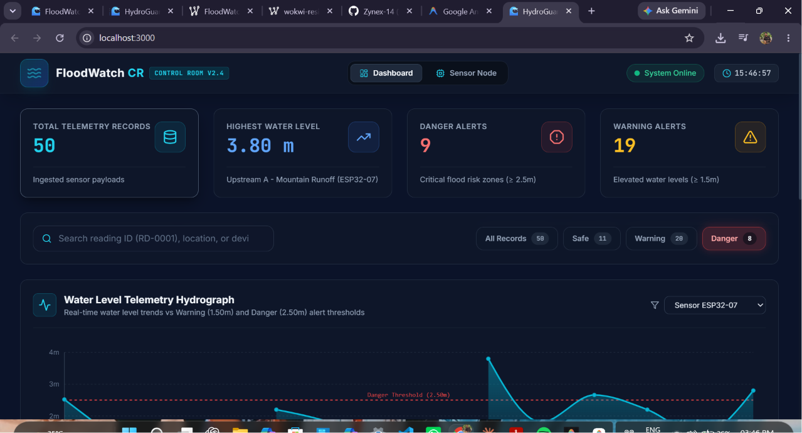
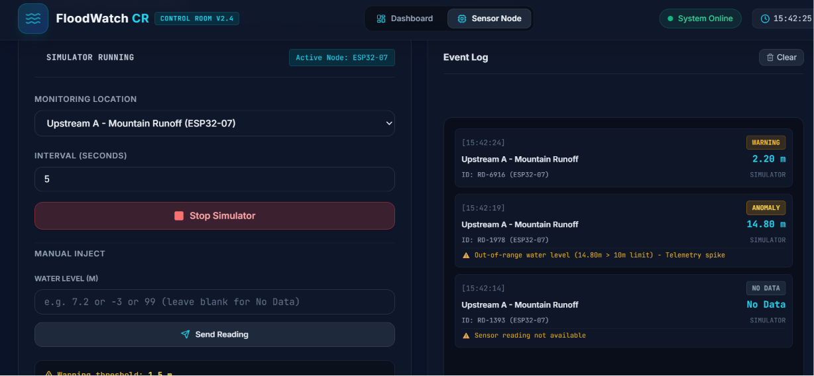
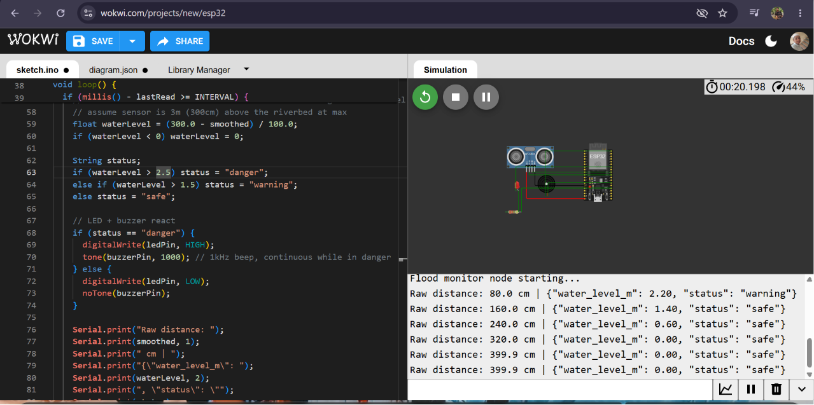
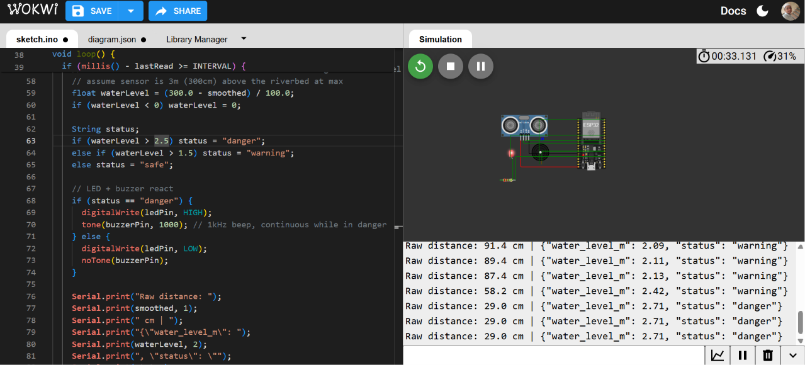
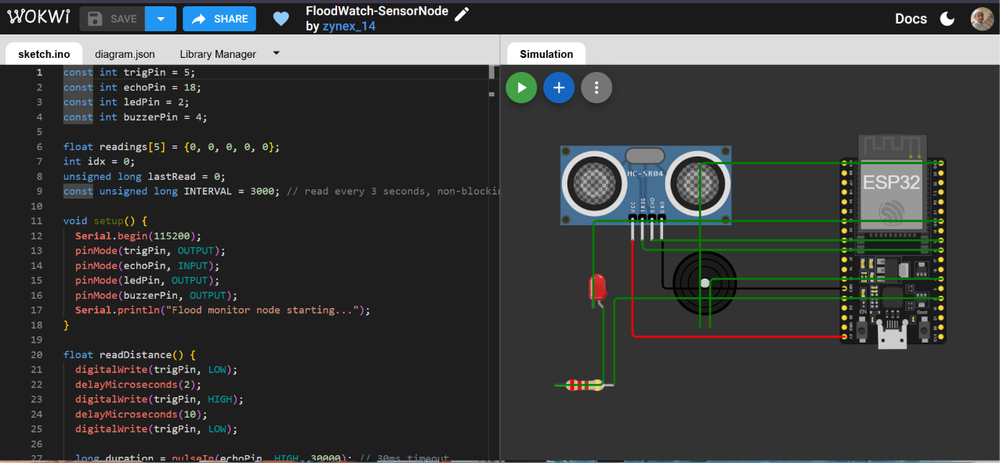

# HydroGuard CR - Smart Flood Monitoring & Early Warning System

## 🚨 Problem Statement
Unpredictable heavy rainfall and urban river overflow cause sudden catastrophic flooding, endangering communities without real-time telemetry oversight.  
This Smart Flood Monitoring Dashboard provides control-room operators with live sensor tracking, early warning alerts, and ESP32 hardware simulation to prevent disaster loss.

---

## 📹 Demonstration Video, Live Deploy & Simulation Links

- 🚀 **Live Production Dashboard (Vercel)**: [[https://smart-flood-monitor-1404-d4vy161mi.vercel.app/](https://river-flood-control-system-dashboard.netlify.app/)
- 🎥 **YouTube Video Walkthrough**: [https://youtu.be/W9fqGsdbizA](https://youtu.be/W9fqGsdbizA)
- 🌐 **Wokwi ESP32 Live Simulation**: [https://wokwi.com/projects/470602393067091969](https://wokwi.com/projects/470602393067091969)
- 🐙 **GitHub Repository**: [https://github.com/Zynex-14/smart-flood-monitor](https://github.com/Zynex-14/smart-flood-monitor)

---

## ⚡ How to Run Your Work Step-by-Step

### Prerequisites
- **Node.js** (v18.0.0 or higher)
- **npm** (v9.0.0 or higher)

### Installation & Execution

1. **Clone the Repository**:
   ```bash
   git clone https://github.com/Zynex-14/smart-flood-monitor.git
   cd smart-flood-monitor
   ```

2. **Install Project Dependencies**:
   ```bash
   npm install
   ```

3. **Start the Local Development Server**:
   ```bash
   npm run dev
   ```

4. **Access the Control Room Dashboard**:
   Open your browser and navigate to **`http://localhost:3000`** or view live online at **[https://smart-flood-monitor-1404-d4vy161mi.vercel.app/](https://smart-flood-monitor-1404-d4vy161mi.vercel.app/)**.

---

## 📸 Screenshots of Working Solution

### 1. Control Room Dashboard — Summary Cards & Hydrograph


*Live Telemetry Overview showing 50 ingested sensor records, Water Level Hydrograph with Warning (1.50m) and Danger (2.50m) thresholds, Summary Cards, and Status Pill Filters (All / Safe / Warning / Danger).*

---

### 2. Sensor Node Simulator — Live Event Log Stream


*Non-blocking timer simulator emitting periodic sensor payloads into the live event log with WARNING, ANOMALY, and NO DATA status events. Manual water-level injector (Manual Inject) also visible.*

---

### 3. Wokwi ESP32 — Warning State Serial Monitor


*Wokwi ESP32 simulation running HC-SR04 distance readings; Serial Monitor showing `"water_level_m": 2.20, "status": "warning"` (distance ~80 cm → level 2.20m).*

---

### 4. Wokwi ESP32 — Danger State (LED + Buzzer Active)


*Serial Monitor showing rapid danger readings at 29 cm distance → 2.71m water level. Red LED (Pin 2) and 1kHz Buzzer (Pin 4) active during all danger readings.*

---

### 5. Wokwi ESP32 — Full Circuit Diagram (HC-SR04 + LED + Buzzer)


*Full hardware wiring: HC-SR04 ultrasonic sensor (Trig → Pin 5, Echo → Pin 18), Red LED (Pin 2 via 220Ω resistor), Buzzer (Pin 4). First Serial output: `"water_level_m": 2.83, "status": "danger"`.*

---

## 📊 Data Schema: What Every Field Means

| Field Name | Type | Description |
| :--- | :--- | :--- |
| `reading_id` | `String` | Unique telemetry packet identifier (e.g., `"RD-0001"`). |
| `location` | `String` | Name of the river, bridge, dam, or drainage canal monitoring point (e.g., `"River A - North Dam"`). |
| `device_id` | `String` | Microcontroller sensor node identifier (e.g., `"ESP32-02"`). |
| `water_level_m` | `Float` \| `null` | Measured water level in meters above riverbed (`null` if sensor is offline). |
| `status` | `String` | Health and risk status (`"safe"`, `"warning"`, `"danger"`, `"no_data"`, `"anomaly"`). |
| `recorded_at` | `ISO String` | Datetime timestamp of telemetry transmission (e.g., `"2026-07-26T06:00:00Z"`). |

---

## 📐 How Derived Figures Are Calculated

### 1. ESP32 HC-SR04 Water Level Calculation
The HC-SR04 ultrasonic sensor measures the distance $d$ (in cm) from the sensor (mounted $300\text{cm} = 3.0\text{m}$ above the riverbed) to the water surface:
$$\text{Water Level (m)} = \max\left(0, \frac{300.0 - \text{Smoothed Distance (cm)}}{100.0}\right)$$

### 2. 5-Sample Rolling Average Noise Filter
To eliminate wave spikes, a 5-sample moving average is calculated across ultrasonic readings:
$$\text{Smoothed Distance} = \frac{1}{5} \sum_{i=1}^{5} d_i$$

### 3. Status Classification Rules
- 🟢 **Safe**: Water Level < 1.50m
- 🟡 **Warning**: 1.50m ≤ Water Level < 2.50m
- 🔴 **Danger**: Water Level ≥ 2.50m → Red LED (Pin 2) ON + 1kHz Buzzer (Pin 4) ON
- ⚪ **No Data**: `water_level_m` = `null`
- ⚠️ **Anomaly**: `water_level_m` < 0.0m or > 10.0m (out-of-range telemetry spike)

### 4. Summary Dashboard Aggregations
- **Highest Water Level**: Maximum across all valid (non-null, non-anomaly) readings
- **Danger Count**: Total records where `status === "danger"`
- **Warning Count**: Total records where `status === "warning"`

---

## 🛠️ What Is Not Finished (Future Roadmap)

- 📡 **Physical MQTT/WebSocket Server Integration**: Currently reads local JSON and simulated ESP32 streams; direct physical hardware MQTT broker connection is planned for production deployment.
- 📱 **Automated SMS Emergency Alerts**: Integration with Twilio API to automatically broadcast SMS alerts to nearby residents when status transitions to `danger`.
- 🗄️ **Persistent Database Storage**: Backend integration with PostgreSQL / TimescaleDB for long-term historical multi-year flood archiving.

---

## 📜 License & Academic Attribution
Created by **Zynex-14** as an Academic Engineering Capstone Project. Open source under the MIT License.
